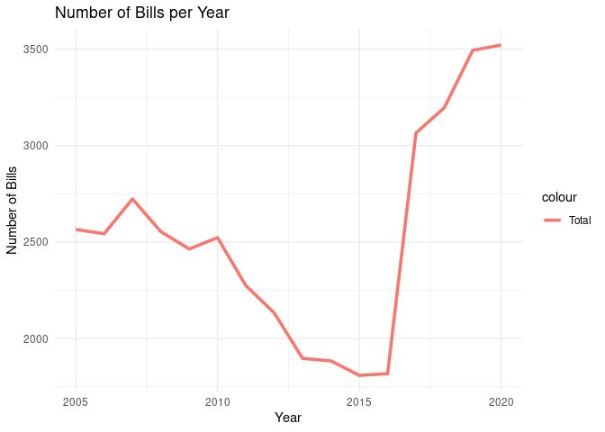
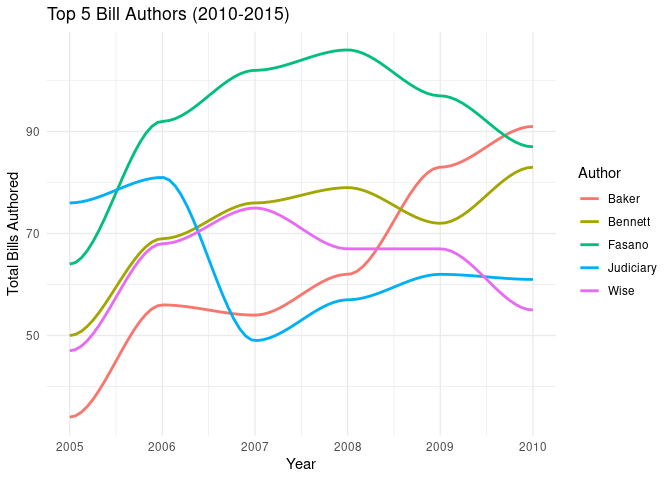
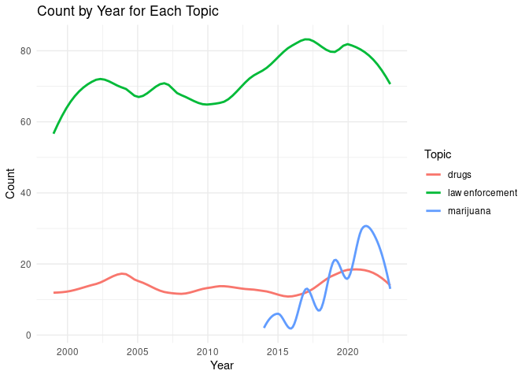
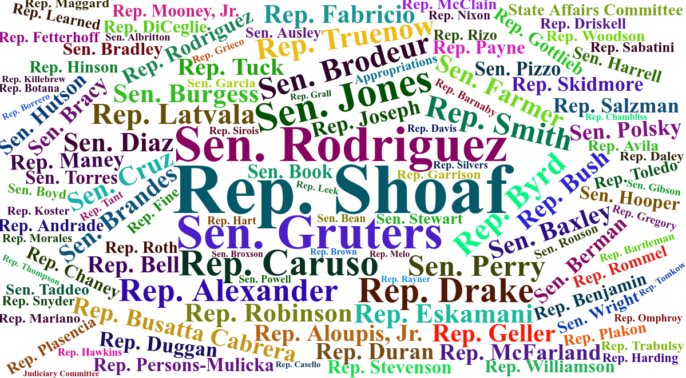

Florida Legislative Bill History (1998-2023)
================

## Introduction

This dataset includes all Florida Legislature bills from 1998-2023 with
info on authors, co-sponsors, vote history, and bill summaries. Each
record also has a link to the full bill text (where available). Each
vote record has a link to the roll call for the vote. (Vote information
could be further mined to create legislative report cards.)

The significance of this dataset lies in its potential to facilitate a
deeper understanding of legislative dynamics in Florida. We believe this
information will be particularly useful for students and researchers in
political science, enabling them to conduct robust analyses and draw
meaningful conclusions about the evolution of policy-making in Florida.
Furthermore, by making this dataset publicly available, we hope to
contribute to a more informed dialogue among citizens, scholars, and
policymakers about the future governance of Florida.

In essence, our goal in publishing this dataset is to support academic
research and civic engagement. We envision that the insights gleaned
from this data will not only advance scholarly understanding but also
aid in the decision-making processes of leaders and citizens, ultimately
contributing to the betterment of the state of Florida.

## Source

The bill information was pulled from the Florida legislative website for
both the House and Senate, located at
<https://flsenate.gov/Session/Bills/>

## Contributing

If you find yourself augmenting the data and feel it could benefit the
community, feel free to open an Issue on the GitHub project. We welcome
contributions and feedback to help make this dataset as useful as
possible.

## Installation

You can install this package from CRAN:

``` r
install.packages("floridagov")
```

Or you can install the development version from GitHub with
[remotes](https://github.com/r-lib/remotes):

``` r
library(remotes)
install_github("opalresearch/floridagov")
```

## Overview

This dataset is broken into the following dataframes:

- bills - Florida Legislative Bills
- authors - Authors of the bills
- cointroducers - Co-Introducers/co-sponsors of the bills
- filed_by - A simplified dataset listing who originally filed the bill
- committee_votes - All recorded votes from each committtee and bill
  version
- floor_votes - All recorded floor votes that occurred
- actions - Actions that were taken on a bill

``` r
# Load the floridagov library
library(floridagov)
library(dplyr) # dplyr used for the following examples
```

### Filed Bills

(There are more columns than this. The following just shows these four
selected columns.)

``` r
data(bills)
head(bills %>% select(Session,Number,Title,Category))
```

    ##   Session Number                             Title      Category
    ## 1    1999   HB 1   State Agency Performance Report  GENERAL BILL
    ## 2    1999   SB 2                          Adoption  GENERAL BILL
    ## 3    1999   HB 3      Child Identification Program  GENERAL BILL
    ## 4    1999   SB 4 Relief/Joseph B. Farver/CFS Dept. CLAIM/GENERAL
    ## 5    1999   HB 5   Immunizations/School Attendance  GENERAL BILL
    ## 6    1999   SB 6  Relief/Marquez/Metro-Dade Police   CLAIM/LOCAL

### Legislative Actions

Legislative actions are listed for each bill as it proceeds through
legislature.

``` r
data(actions)
head(actions)
```

    ## # A tibble: 6 × 4
    ##    Year Session Number Action                                                 
    ##   <dbl> <chr>   <chr>  <chr>                                                  
    ## 1  1999 1999    HB 1   Approved by Governor                                   
    ## 2  1999 1999    HB 1   Chapter No. 99-377                                     
    ## 3  1999 1999    HB 1   See also CS/HB 1927 (Ch. 99-393), HB 2125 (Ch. 99-397) 
    ## 4  1999 1999    SB 2   H Died in Messages                                     
    ## 5  1999 1999    HB 3   S Died in Committee on Health, Aging and Long-Term Care
    ## 6  1999 1999    SB 4   Approved by Governor

## Exploring Further

You can explore the data further and create plots. Let’s take a look a
few examples.

### Bills Filed Per Year

A straightforward plot to begin with is a the number of bills filed in
the 15-year period from 2005 and 2020.

``` r
library(ggplot2)

data(bills)

bills_summary <- bills %>%
  filter(Year >= 2005 & Year <= 2020 ) %>%
  group_by(Year) %>%
  summarize(Total = n())

ggplot(bills_summary, aes(x = Year)) +
  geom_smooth(aes(y = Total, colour = "Total"), span=0.3,, se=FALSE) +
  theme_minimal() +
  xlab("Year") +
  ylab("Number of Bills") +
  ggtitle("Number of Bills per Year")
```

<!-- -->

### Top Bill Authors From 2010 to 2015

For the period of 2010 through 2015, the top bill authors were:

``` r
library(ggplot2)

data(authors)

filtered_authors <- authors %>%
  filter(Year >= 2005, Year <= 2010) %>%
  group_by(Author, Year) %>%
  summarise(TotalBills = n(), .groups = 'drop')

# Finding the top 5 authors
top_authors <- filtered_authors %>%
  group_by(Author) %>%
  summarise(Total = sum(TotalBills), .groups = 'drop') %>%
  top_n(5, Total) %>%
  select(Author)

# Filtering the data for only top authors
top_authors_data <- filtered_authors %>%
  filter(Author %in% top_authors$Author)

# Plotting the data
ggplot(top_authors_data, aes(x = Year, y = TotalBills, group = Author, color = Author)) +
  geom_smooth(method = "loess", span=0.6, se = FALSE) +
  labs(title = "Top 5 Bill Authors (2010-2015)",
       x = "Year", y = "Total Bills Authored") +
  theme_minimal()
```

<!-- -->

### Bills by Various Topics of Interest

Perhaps your research is concerned with drugs (legal or otherwise) and
law enforcement. A simple full-text search of the bill summaries for
keywords of interest could be a good starting point.

``` r
library(ggplot2)
library(stringr)

data(bills)

topics <- c("law enforcement", "marijuana", "drugs")

# Create a function to determine the topic based on summary
find_topic <- function(summary) {
  for (topic in topics) {
    if (str_detect(summary, regex(topic, ignore_case = TRUE))) {
      return(topic)
    }
  }
  return(NA)
}

# Create the new dataframe with the additional Topic column
bill_topics <- bills %>%
  mutate(Topic = sapply(Summary, find_topic)) %>%
  na.omit()

# Group by Year and Topic, then count
year_topic_count <- bill_topics %>%
  group_by(Year, Topic) %>%
  summarise(Count = n(), .groups = 'drop')

# Plotting the data
ggplot(year_topic_count, aes(x = Year, y = Count, group = Topic, color = Topic)) +
  geom_smooth(method = "loess", span=0.4, se = FALSE) +
  labs(title = "Count by Year for Each Topic",
       x = "Year", y = "Count") +
  theme_minimal()
```

<!-- -->

### Wordcloud Visualiztions

Simple visualizations are often the most powerful communicators. Let’s
take a look at all the bill filers for the the year 2022 and put them
into a wordcloud.

    library(dplyr)
    library(wordcloud2)
    library(stringr)

    data(bills)

    # Summarize the data to get the frequency of each category
    filer_freq <- bills %>%
      filter(Year == 2022) %>%
      select(FiledBy) %>%
      group_by(FiledBy) %>%
      summarise(Frequency = n(), .groups = 'drop') %>%
      filter(Frequency > 1) %>%
      arrange(desc(Frequency))

    # Using wordcloud2 to create the word cloud
    wordcloud2(filer_freq)

<figure>

<figcaption aria-hidden="true">Wordcloud of 2022 Florida Legislative
Bill Filers</figcaption>
</figure>
