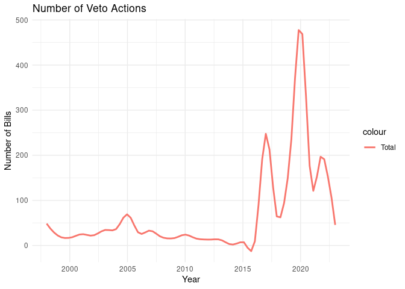
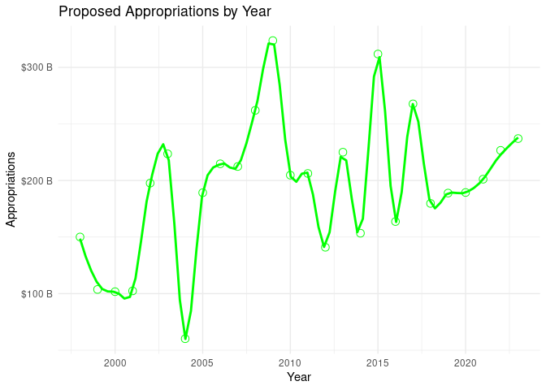
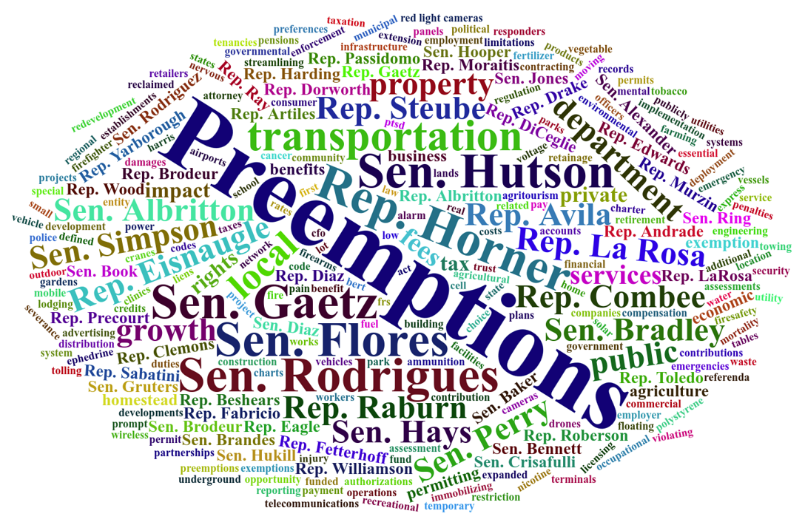

Florida Legislative Bill History (1998-2023)
================

## Introduction

This dataset includes all Florida Legislature bills from 1998-2023 with
info on authors, co-sponsors, vote history, and bill summaries. Each
record also has a link to the full bill text (where available). Each
vote record has a link to the roll call for the vote. (Vote information
could be further mined to create legislative report cards.)

The significance of this dataset lies in its potential to facilitate a
deeper understanding of legislative dynamics in Florida. We believe this
information will be particularly useful for students and researchers in
political science, enabling them to conduct robust analyses and draw
meaningful conclusions about the evolution of policy-making in Florida.
Furthermore, by making this dataset publicly available, we hope to
contribute to a more informed dialogue among citizens, scholars, and
policymakers about the future governance of Florida.

In essence, our goal in publishing this dataset is to support academic
research and civic engagement. We envision that the insights gleaned
from this data will not only advance scholarly understanding but also
aid in the decision-making processes of leaders and citizens, ultimately
contributing to the betterment of the state of Florida.

## Source

The bill information was pulled from the Florida legislative website for
both the House and Senate, located at
<https://flsenate.gov/Session/Bills/>

## Contributing

If you find yourself augmenting the data and feel it could benefit the
community, feel free to open an Issue on the GitHub project. We welcome
contributions and feedback to help make this dataset as useful as
possible.

## Installation

You can install the development version from GitHub with
[remotes](https://github.com/r-lib/remotes):

``` r
library(remotes)
install_github("opalresearch/floridagov")
```

## Overview

This dataset is broken into the following dataframes:

- bills - Florida Legislative Bills
- authors - Authors of the bills
- cointroducers - Co-Introducers/co-sponsors of the bills
- filed_by - A simplified dataset listing who originally filed the bill
- committee_votes - All recorded votes from each committtee and bill
  version
- floor_votes - All recorded floor votes that occurred
- actions - Actions that were taken on a bill
- appropriations - Bills with appropriations
- preemptions - Bills between 2010 and 2022 that preempted local
  government authority

``` r
# Load the floridagov library
library(floridagov)
library(dplyr) # dplyr used for the following examples

# Load one or more of the datasets
data(bills)
data(floor_votes)
data(preemptions)
```

### Filed Bills

(There are more columns than this. The following just shows these four
selected columns.)

``` r
data(bills)
head(bills %>% filter( Year == 2015) %>% select(Session,Number,Title,Category))
```

    ##   Session Number
    ## 1    2015   HB 1
    ## 2    2015   SB 2
    ## 3    2015   HB 3
    ## 4    2015   HB 5
    ## 5    2015   HB 7
    ## 6    2015   HB 9
    ##                                                                   Title
    ## 1                                                 Texting While Driving
    ## 2                                             Greyhound Racing Injuries
    ## 3                                         Closing the Gap Grant Program
    ## 4                                              Guardianship Proceedings
    ## 5                 Pub. Rec./Claim Settlement on Behalf of Minor or Ward
    ## 6 Use Of Wireless Communications Device While Operating a Motor Vehicle
    ##                      Category
    ## 1                GENERAL BILL
    ## 2                GENERAL BILL
    ## 3                GENERAL BILL
    ## 4                GENERAL BILL
    ## 5 PUBLIC RECORDS/GENERAL BILL
    ## 6                GENERAL BILL

### Legislative Actions

Legislative actions are listed for each bill as it proceeds through
legislature.

``` r
data(actions)
head(actions)
```

    ## # A tibble: 6 × 4
    ##    Year Session Number Action                                 
    ##   <dbl> <chr>   <chr>  <chr>                                  
    ## 1  1998 1998    HB 1   H Withdrawn                            
    ## 2  1998 1998    SB 2   Became Law without Governor's Signature
    ## 3  1998 1998    SB 2   Chapter No. 98-425 -SJ 00458           
    ## 4  1998 1998    HB 3   Approved by Governor                   
    ## 5  1998 1998    HB 3   Chapter No. 97-29 -HJ 01218            
    ## 6  1998 1998    SB 4   S House Bill substituted -SJ 00170

### Appropriations

Proposed appropriation bills and their amounts

``` r
data(appropriations)
head(appropriations)
```

    ##   Year Chamber Session Number Claim  Amount
    ## 1 1998  Senate    1998   SB 2  TRUE 1400000
    ## 2 1998  Senate    1998  SB 10  TRUE  250000
    ## 3 1998  Senate    1998  SB 12  TRUE  450000
    ## 4 1998  Senate    1998  SB 18  TRUE   18230
    ## 5 1998  Senate    1998  SB 20  TRUE   15402
    ## 6 1998  Senate    1998  SB 28  TRUE 4600000

### Votes

Legislative votes are included, both committee votes and floor votes.

``` r
# Committee Votes
data(committee_votes)
head(committee_votes)
```

    ## # A tibble: 6 × 9
    ##   Session Number Version   Date        Committee  Yeas  Nays VoteResultUrl  Year
    ##   <chr>   <chr>  <chr>     <chr>       <chr>     <dbl> <dbl> <chr>         <dbl>
    ## 1 1998    HB 1   H 1 Filed 9/18/1997 … House         0   120 https://www.…  1998
    ## 2 1998    HB 1   H 1 Filed 2/24/1998 … House         0   119 https://www.…  1998
    ## 3 1998    HB 1   H 1 Filed 3/5/1998 3… House        15     0 https://www.…  1998
    ## 4 1998    HB 1   H 1 Filed 3/11/1998 … House        17     0 https://www.…  1998
    ## 5 1998    HB 1   H 1 Filed 3/17/1998 … House        16     0 https://www.…  1998
    ## 6 1998    HB 1   H 1 Filed 5/1/1998 1… Senate       40     0 https://www.…  1998

``` r
# Floor Votes
data(committee_votes)
head(committee_votes)
```

    ## # A tibble: 6 × 9
    ##   Session Number Version   Date        Committee  Yeas  Nays VoteResultUrl  Year
    ##   <chr>   <chr>  <chr>     <chr>       <chr>     <dbl> <dbl> <chr>         <dbl>
    ## 1 1998    HB 1   H 1 Filed 9/18/1997 … House         0   120 https://www.…  1998
    ## 2 1998    HB 1   H 1 Filed 2/24/1998 … House         0   119 https://www.…  1998
    ## 3 1998    HB 1   H 1 Filed 3/5/1998 3… House        15     0 https://www.…  1998
    ## 4 1998    HB 1   H 1 Filed 3/11/1998 … House        17     0 https://www.…  1998
    ## 5 1998    HB 1   H 1 Filed 3/17/1998 … House        16     0 https://www.…  1998
    ## 6 1998    HB 1   H 1 Filed 5/1/1998 1… Senate       40     0 https://www.…  1998

## Exploring Further

You can explore the data further and create plots. Let’s take a look a
few examples.

### Bills Filed Per Year

A straightforward plot to begin with is a the number of bills filed in
the 15-year period from 2005 and 2020. (Note: The minimum point on the
graph is around 1800 bills filed in the years 2015 and 2016.)

``` r
library(ggplot2)

data(bills)

bills_summary <- bills %>%
  filter(Year >= 2005 & Year <= 2020 ) %>%
  group_by(Year) %>%
  summarize(Total = n())

ggplot(bills_summary, aes(x = Year)) +
  geom_line(aes(y = Total, colour = "Total"), size=1.25) +
  theme_minimal() +
  xlab("Year") +
  ylab("Number of Bills") +
  ggtitle("Number of Bills per Year")
```

<!-- -->

### Veto Actions Per Year

Let’s take a look at the number of veto actions across all years in the
dataset, and adding some smoothing to the graph.

``` r
library(ggplot2)
library(stringr)

data(actions)

bills_veto_summary <- actions %>%
  filter( str_detect(Action, 'Veto')) %>%
  group_by(Year) %>%
  summarize(Total = n())

ggplot(bills_veto_summary, aes(x = Year)) +
  geom_smooth(aes(y = Total, colour = "Total"), span=0.2,, se=FALSE) +
  theme_minimal() +
  xlab("Year") +
  ylab("Number of Bills") +
  ggtitle("Number of Veto Actions")
```

<!-- -->

### Proposed Appropriations by Year

Appropriation bills (excluding claims) for the entire period, total
amount per year”

``` r
library(dplyr)
library(ggplot2)
library(scales)  # For label_number()

# Summarize the data
yearly_totals <- appropriations %>%
  filter(Claim == FALSE) %>%
  group_by(Year) %>%
  summarize(TotalAmount = sum(Amount, na.rm = TRUE))

# Plot the data

# Proposed Appropriations by Year
ggplot(yearly_totals, aes(x = Year, y = TotalAmount)) +
  #  geom_line() +  # Creates the line plot
  geom_point(shape = 1, color = "green", size = 3, fill = NA) +  # Small, blue, unfilled circles
  geom_smooth(method = "loess", span = 0.2, se = FALSE, color = "green") +  # Adds a smoothed line
  scale_y_continuous(labels = label_number(suffix = " B", prefix = "$", scale = 1e-9)) + # millions
  labs(title = "Proposed Appropriations by Year", 
       x = "Year", 
       y = "Appropriations") +
  theme_minimal()
```

<!-- -->

### Top Bill Authors From 2010 to 2015

For the period of 2010 through 2015, the top bill authors were:

``` r
library(ggplot2)

data(authors)

filtered_authors <- authors %>%
  filter(Year >= 2005, Year <= 2010) %>%
  group_by(Author, Year) %>%
  summarise(TotalBills = n(), .groups = 'drop')

# Finding the top 5 authors
top_authors <- filtered_authors %>%
  group_by(Author) %>%
  summarise(Total = sum(TotalBills), .groups = 'drop') %>%
  top_n(5, Total) %>%
  select(Author)

# Filtering the data for only top authors
top_authors_data <- filtered_authors %>%
  filter(Author %in% top_authors$Author)

# Plotting the data
ggplot(top_authors_data, aes(x = Year, y = TotalBills, group = Author, color = Author)) +
  geom_smooth(method = "loess", span=0.4, se = FALSE) +
  labs(title = "Top 5 Bill Authors (2010-2015)",
       x = "Year", y = "Total Bills Authored") +
  theme_minimal()
```

<!-- -->

### Bills by Various Topics of Interest

Perhaps your research is concerned with drugs (legal or otherwise) and
law enforcement. A simple full-text search of the bill summaries for
keywords of interest could be a good starting point.

    library(ggplot2)
    library(stringr)

    data(bills)

    topics <- c("law enforcement", "marijuana", "drugs")

    # Create a function to determine the topic based on summary
    find_topic <- function(summary) {
      for (topic in topics) {
        if (str_detect(summary, regex(topic, ignore_case = TRUE))) {
          return(topic)
        }
      }
      return(NA)
    }

    # Create the new dataframe with the additional Topic column
    bill_topics <- bills %>%
      mutate(Topic = sapply(Summary, find_topic)) %>%
      na.omit()

    # Group by Year and Topic, then count
    year_topic_count <- bill_topics %>%
      group_by(Year, Topic) %>%
      summarise(Count = n(), .groups = 'drop')

    # Plotting the data
    ggplot(year_topic_count, aes(x = Year, y = Count, group = Topic, color = Topic)) +
      geom_smooth(method = "loess", span=0.4, se = FALSE) +
      labs(title = "Count by Year for Each Topic",
           x = "Year", y = "Count") +
      theme_minimal()


### Wordcloud Visualiztions

Simple visualizations are often the most powerful communicators. Let’s
take a look at all the bill filers for the the year 2022 and put them
into a wordcloud.

    library(dplyr)
    library(wordcloud2)
    library(stringr)

    data(bills)

    # Summarize the data to get the frequency of each category
    filer_freq <- bills %>%
      filter(Year == 2022) %>%
      select(FiledBy) %>%
      group_by(FiledBy) %>%
      summarise(Frequency = n(), .groups = 'drop') %>%
      filter(Frequency > 1) %>%
      arrange(desc(Frequency))

    # Using wordcloud2 to create the word cloud
    wordcloud2(filer_freq)


The possibilities are endless. The following wordcloud is a
representation of the frequency of bill filers (filed_by) who filed
local government preemptions between 2010 and 2022, as identified by the
Florida League of Cities researchers (preemptions), along with topic
frequencies pulled from bill titles (bills) (using tidytext to filter
out stop words). The frequency of filers was scaled compared to topics
to aid in visualization.



## Next Steps

By examining the comprehensive details of legislative bills from 1998 to
2023, including authors, filers, co-introducers, legislative actions,
and voting results, scholars can gain deep insights into the workings of
the Florida legislature. Additionally, the data from the Florida League
of Cities adds a unique dimension by highlighting instances where state
legislation has overridden local government autonomy.

This dataset is not just a historical record; it’s a laboratory for
testing theories and models in political science. For example,
researchers can explore the impact of political affiliation on
legislative success. By comparing the success rate of bills authored by
different parties, insights can be gained into partisan dynamics within
the legislature. Additionally, by analyzing the full bill summaries and
vote results, one could investigate the role of legislative framing and
rhetoric in securing votes. This could involve using natural language
processing techniques to identify which phrases or styles correlate with
successful legislation.

Moreover, the dataset provides opportunities to delve into the nuances
of policy areas. Researchers might examine trends in environmental,
educational, or health-related bills, providing a window into how
priorities have shifted over time. They can also explore the
relationship between lobbyists and legislation, by linking bill subjects
with lobbying activities. Furthermore, advanced statistical analysis
could reveal hidden patterns in legislative activity, such as
identifying periods of high legislative productivity or stagnation.

Additional research ideas could include:

- Analyzing the effect of external events (like natural disasters or
  economic recessions) on the types of bills introduced and passed.
- Investigating the role of demographics in legislative success: Are
  bills introduced by women or minority legislators more or less likely
  to pass? How about bills from rural vs urban/suburban districts?
  Freshman vs senior legislators?
- Studying amendments to bills: What types of amendments are most
  common, and how do they affect a bill’s likelihood of passage?
- Correlating electoral cycles with legislative activity: Is there a
  noticeable change in the types of bills filed or passed in election
  years?
- Using sentiment analysis to gauge public opinion on certain bills,
  possibly linking it with social media data.

Most importantly, the results of this research, and this and other
datasets, can be used to produce effective visualizations to better
communicate the traditionally complex world of politics simply and
effectively to voters.

By engaging with this dataset, political science students and
researchers can not only contribute to the academic understanding of
legislative processes but also potentially influence future policymaking
through their findings. The possibilities for discovery and impact are
vast, making this dataset an invaluable resource for those seeking to
delve deeper into the world of political science and data analytics.

## Credits

Data was sourced from the legislative website(s) of the State of Florida
(<https://flsenate.gov/>) and the Florida League of Cities
(<https://flcities.com/>). It was compiled and published by Steven
Brendtro of Opal Research.
